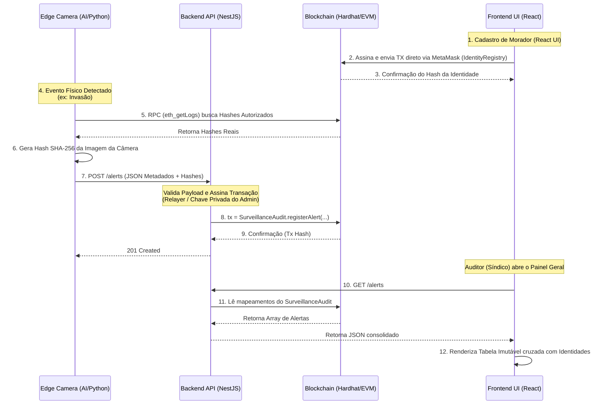

# Arquitetura de Auditoria Imutável (Web3 / Segurança)

Este documento justifica as decisões arquiteturais da plataforma de vigilância baseada em Blockchain.

## 1. Por que usar Blockchain em Segurança Física?

Sistemas de vigilância tradicionais (bancos de dados SQL, logs em servidores locais) sofrem com o problema do **ponto único de falha e de confiança**. Um administrador de TI malicioso, um hacker ou uma coerção física (suborno) pode resultar na exclusão de um registro vital de segurança ("Morador Reconhecido", "Invasor não autorizado") sem deixar rastros detectáveis.

Ao enviar o registro de segurança para um Smart Contract em uma rede Blockchain:
- **Imutabilidade Criptográfica**: Uma vez minerado o bloco, nem mesmo o criador do sistema pode alterar ou apagar o log.
- **Transparência Auditável**: Síndicos, moradores e auditores externos podem verificar de forma independente que um alerta ocorreu em um exato momento temporal (Block Timestamp).

## 2. Conformidade Legal (LGPD) e o Paradoxo da Biometria

A Lei Geral de Proteção de Dados (LGPD) exige que dados sensíveis, como biometria facial, possam ser anonimizados ou removidos sob solicitação do titular (Direito ao Esquecimento).
Contudo, dados na blockchain **nunca** podem ser apagados.

**A Solução (Hash Pattern):**
Para resolver este impasse, o nosso sistema trabalha em duas camadas:
1. **Edge (Câmera IoT / Borda)**: Processa a imagem real, detecta o evento e gera um *Hash Criptográfico* (SHA-256) dessa imagem. A imagem em si é descartada ou guardada em um armazenamento centralizado e efêmero (que pode ser apagado se o usuário solicitar).
2. **Blockchain (Ledger)**: Apenas o hash (`imageHash`) e os metadados textuais (`cameraId`, `timestamp`, `alertType`) são registrados no Smart Contract. 

O hash atua como uma "impressão digital". Se a imagem real for questionada no tribunal, qualquer auditor pode calcular o hash da imagem original e comprovar matematicamente que ela corresponde ao registro imutável gravado na blockchain na data do ocorrido.

## 3. Otimização de Custo (Gas) na Web3

Em redes públicas baseadas na EVM (Ethereum Virtual Machine), o custo de armazenamento (Gas) é extremamente alto.
- **Uso do `bytes32`**: No Solidity, o hash SHA-256 é perfeitamente mapeado para o tipo `bytes32`. Em vez de usar `string` (que custa mais gás por ter tamanho dinâmico e exigir encoding pesado), forçamos o contrato a aceitar `bytes32`. Isso reduz significativamente as taxas de transação da administradora do condomínio.
- **Custom Errors**: Utilizou-se a syntax `error NotAuthorized()` do Solidity nativo ao invés de strings longas em `require()`, economizando gás precioso na validação do controle de acesso.

## 4. Cadastro de Identidades (Web3 Nativo)

A plataforma utiliza o contrato `IdentityRegistry.sol` para gerenciar os hashes das identidades autorizadas. Diferente da auditoria de câmeras (onde o Backend atua como um *relayer* de alta velocidade), **o cadastro de identidades é feito de forma 100% descentralizada (Web3 Native)**.

A aplicação React (Frontend) interage diretamente com o nó RPC usando `ethers.js` e a **MetaMask** do administrador. Isso garante que:
- O atributo `msg.sender` no contrato inteligente reflete a verdadeira carteira do síndico que autorizou a pessoa, e não um servidor centralizado.
- O sistema de AI (Python) na borda pode consultar os eventos públicos deste contrato (via `eth_getLogs`) para alimentar seu banco local de hashes conhecidos sem depender de bancos de dados.

## 5. Diagrama de Fluxo de Dados (Data Flow)

